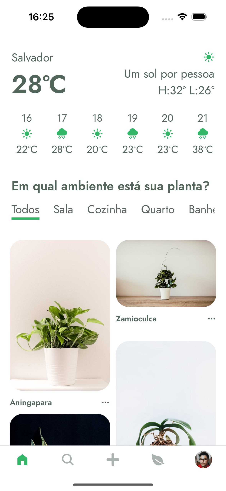
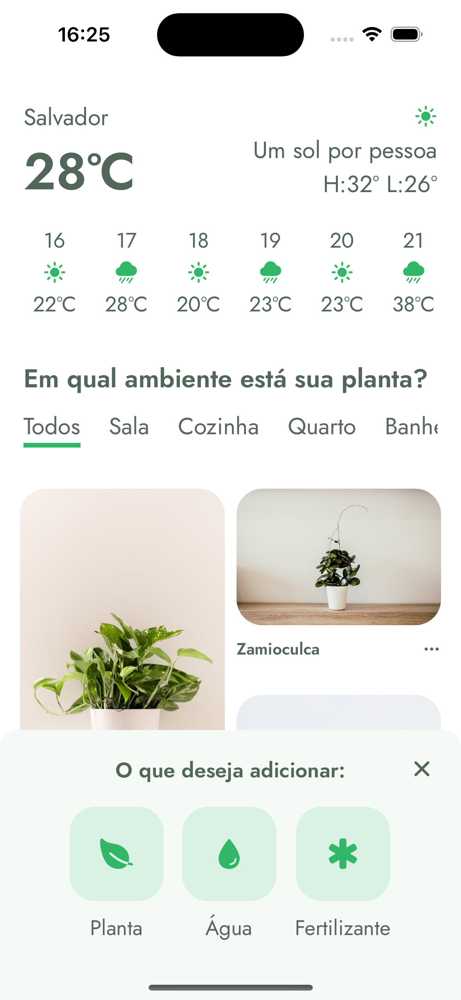
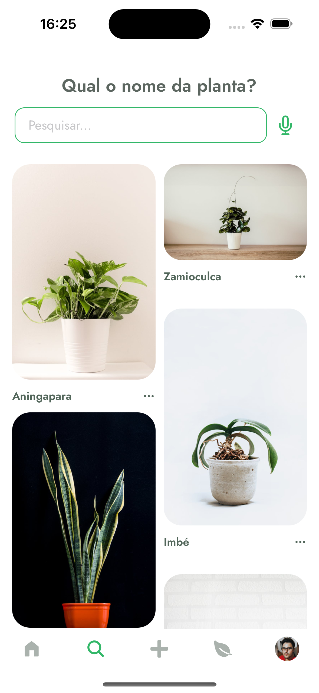
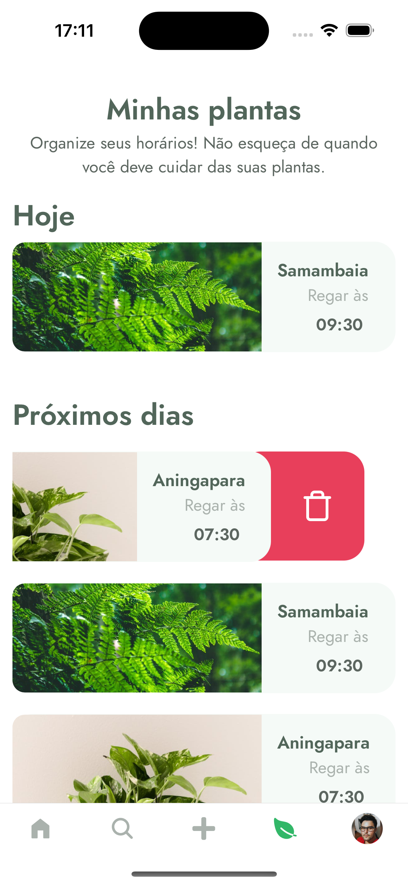
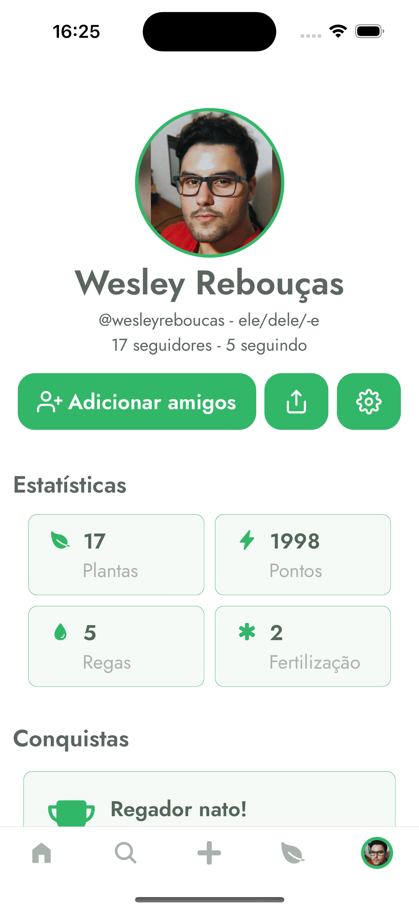

<div >
  
</div>

<p align="center">
	<a href="https://www.linkedin.com/in/wesley-andrade/">	
		
	</a>
	<a href="https://choosealicense.com/licenses/mit/">	
		
	</a>
</p>

<p align="center">
  <a href="#project">Project</a>&nbsp;&nbsp;&nbsp;|&nbsp;&nbsp;&nbsp;
  <a href="#layout">Layout</a>&nbsp;&nbsp;&nbsp;|&nbsp;&nbsp;&nbsp;
  <a href="#technologies">Technologies</a>&nbsp;&nbsp;&nbsp;|&nbsp;&nbsp;&nbsp;
  <a href="#installation">Installation</a>&nbsp;&nbsp;&nbsp;|&nbsp;&nbsp;&nbsp;
  <a href="#goals">Goals</a>&nbsp;&nbsp;&nbsp;|&nbsp;&nbsp;&nbsp;
  <a href="#page_with_curl-license">License</a>
</p>

## Project

Plant Manager is an application under development, initially conceived by <a href="https://www.rocketseat.com.br/"> **Rocketseat** </a> to facilitate plant management in home environments. Using <a href="https://reactnative.dev/"> **React Native** </a> technology, the primary goal is to create a platform that allows users to catalog their plants while also providing functionality for scheduling reminders to water them.
 
The next step is to expand the application's functionality in future phases, including replication in <a href="https://www.apple.com/br/swift/"> **Swift (IOS)** </a>, so that I can demonstrate proficiency in the respective languages and highlighting versatility in different development environments.

## Layout

#### The original project: [Figma](https://www.figma.com/file/6qTBqI6uPZiyCkLUEKL2pV/PlantManager)

<div style="display: flex; flex-direction: 'row'; align-items: 'center';">
		
	
	
	
	
</div>

## Technologies

- [React Native](https://reactnative.dev/)
- [Expo](https://expo.dev/)
- [React Voice](https://github.com/react-native-voice/voice)
- [Skeleton Moti](https://moti.fyi/skeleton)
- [Gesture Handler](https://docs.expo.dev/versions/latest/sdk/gesture-handler/)
- [Reanimated](https://docs.expo.dev/versions/latest/sdk/reanimated/)

## Goals

#### v1.0:
- [ ] Create UI
- [ ] Plant listing;
- [ ] Plant CRUD operations;
- [ ] Alert reception: Alerts for watering;
- [ ] Authentication with name: Use the name to access plants per profile.
  
## Installation

#### Clone the Repository
```bash
git clone https://github.com/WesleyReboucas/PlantManager.git
cd PlantManager/
```
##### React Native - IOS
```bash
npm i && npx expo run:ios
```
##### React Native - Android
```bash
npm i && npx expo run:android
```

## :page_with_curl: License

<div>
  This project is under the MIT license.   
</div>
<a href="https://choosealicense.com/licenses/mit/">
	
</a>

---

Made with ♥ by Wesley Rebouças


